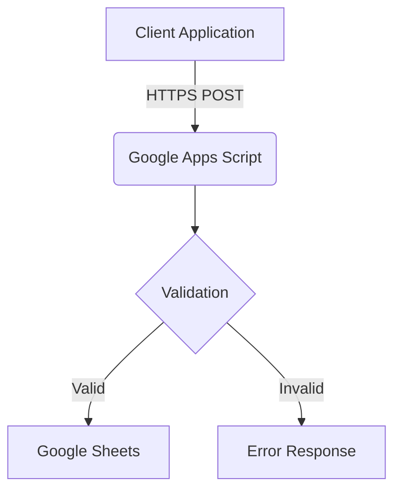

# 📝 Google Apps Script Form Handler


This script serves as a backend endpoint for handling `POST` requests and storing form submissions into a Google Sheet.

## 📌 Features

- Accepts `POST` requests with JSON payload.
- Automatically assigns a unique serial number to each entry.
- Appends new data to a specified Google Sheet.
- Returns JSON responses indicating success or error.

---

## 📂 Google Sheet Setup

1. Create a new Google Sheet.
2. Name the first sheet as `Sheet1` (or change the `SHEET_NAME` constant in the script accordingly).
3. Add the following headers in row 1 (starting at A1):

```
Serial Number | Parent Name | Child Name | Email | Phone | Age Group | Preferred Sport | Location | Distance | Received At
```

---

## 🚀 Deployment

1. Open [Google Apps Script](https://script.google.com) and create a new project.
2. Paste the script into the editor.
3. Click **Deploy > Manage Deployments**.
4. Select **Web app**, then:
   - Set **Execute as**: *Me*
   - Set **Who has access**: *Anyone*
5. Click **Deploy** and copy the URL.

---



## 📬 POST Request Format

Send a `POST` request to the deployed URL with the following JSON structure:

```json
{
  "parentName": "John Doe",
  "childName": "Jane Doe",
  "email": "john@example.com",
  "phone": "1234567890",
  "ageGroup": "8-10",
  "preferredSport": "Soccer",
  "location": "Downtown",
  "distance": "5km"
}
```

### ✅ Sample Success Response

```json
{
  "status": "success",
  "message": "Data saved successfully"
}
```

### ❌ Sample Error Response

```json
{
  "status": "error",
  "message": "Error details here"
}
```

---

## 🧪 Example cURL Command

Use the following `cURL` command to test the endpoint:

```bash
curl -X POST "https://script.google.com/macros/s/YOUR_DEPLOYMENT_ID/exec" \
  -H "Content-Type: application/json" \
  -d '{
    "parentName": "John Doe",
    "childName": "Jane Doe",
    "email": "john@example.com",
    "phone": "1234567890",
    "ageGroup": "8-10",
    "preferredSport": "Soccer",
    "location": "Downtown",
    "distance": "5km"
  }'
```

Replace `YOUR_DEPLOYMENT_ID` with the actual deployment ID from your Apps Script deployment.

---

## 🛠️ Customization

- Change `SHEET_NAME` at the top of the script to match your desired sheet tab name.
- Add or remove fields in both the script and sheet headers as needed.

---

## 📄 License

MIT License. Free to use and modify.
